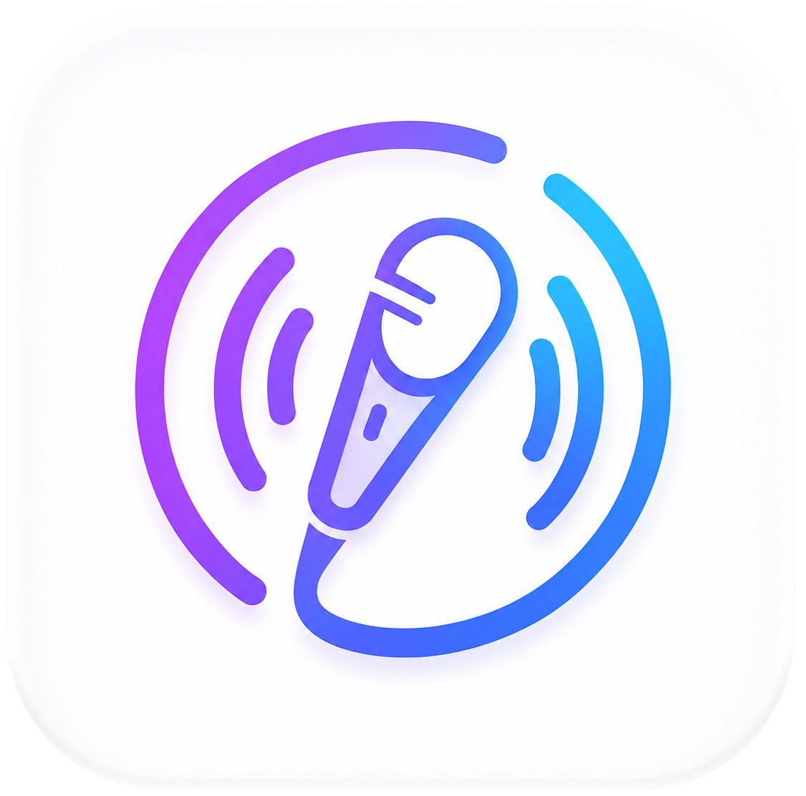
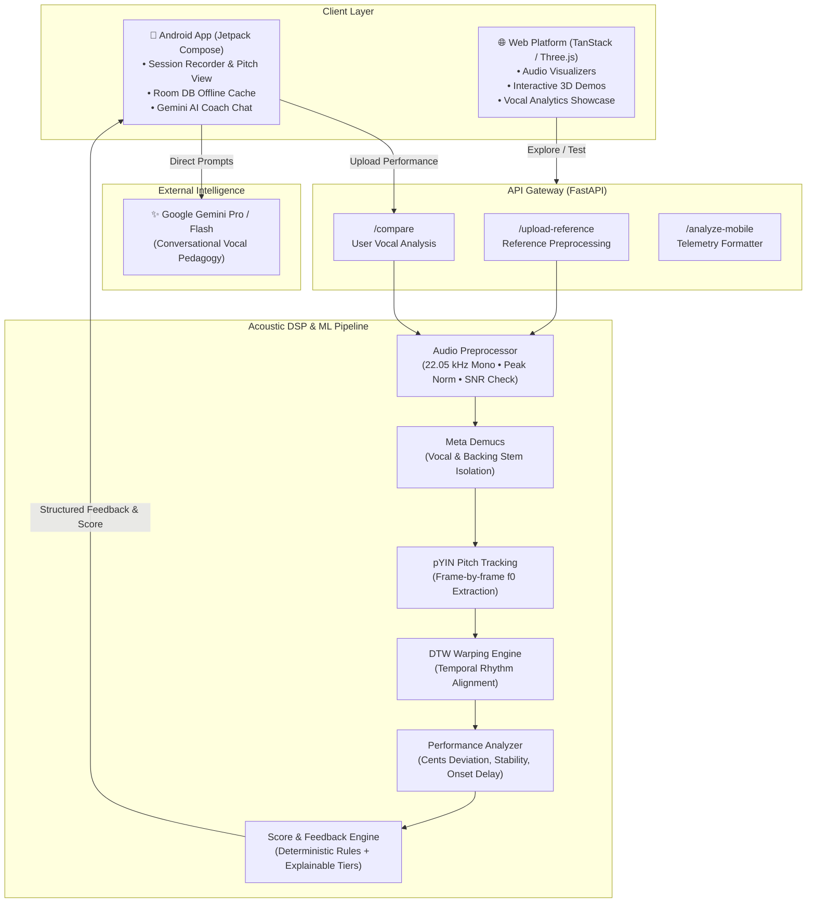

# 🎵 Cadenza: AI-Powered Vocal Coach & Performance Intelligence

<p align="center">
  
</p>

<p align="center">
  <strong>Master your voice with intelligent pitch tracking, vocal stem separation, dynamic alignment, and personal AI coaching.</strong>
</p>

<p align="center">
  <a href="#-features"></a>
  <a href="#-system-architecture"></a>
  <a href="#-tech-stack"></a>
  <a href="#-getting-started"></a>
</p>

---

## 📌 Executive Summary

**Cadenza** is an end-to-end vocal training and acoustic performance analysis ecosystem. Traditional vocal training often lacks immediate, objective data on pitch accuracy, rhythmic alignment, and vocal stability. Cadenza bridges this gap by merging state-of-the-art **audio signal processing (DSP)**, **deep learning stem separation**, and **generative AI coaching**.

The platform is structured into three integrated layers:
1. 📱 **Mobile Application (`/app`)**: Modern Android app built with **Jetpack Compose**, **Room DB**, and **Retrofit**, giving singers a real-time recording interface, interactive pitch telemetry, session archives, and customizable coach personas powered by **Google Gemini**.
2. 🔬 **Acoustic Intelligence Backend (`/backend`)**: High-performance **FastAPI** server powered by **Demucs** (AI source separation), **pYIN / Librosa** (pitch tracking), **dtaidistance / DTW** (Dynamic Time Warping for temporal alignment), and algorithmic vocal evaluation scoring.
3. 🌐 **Web Showcase & Landing Hub (`/web-page`)**: Futuristic web application built on **React 19**, **TanStack Start/Router**, **Tailwind CSS**, and **Three.js / React Three Fiber** featuring 3D visuals, audio waveforms, and interactive product walkthroughs.

---

## 🚀 Core Features

### 1. 🎙️ High-Precision Pitch Detection & Note Mapping
- **Probabilistic YIN (pYIN)**: Fundamental frequency ($f_0$) tracking across a musical range spanning from $C_2$ (65.4 Hz) to $C_7$ (2093.0 Hz).
- **Sub-Semitone Precision**: Calculates frequency offsets in **musical cents** ($1 \text{ semitone} = 100 \text{ cents}$) with a tight $\pm 10\text{ cents}$ threshold for pitch-perfect verification.
- **Voice Activity Detection (VAD)**: Energy and voicing probability masks isolate vocal frames from breath pauses and ambient noise.

### 2. 🎼 AI Stem Separation & Accompaniment Generation
- Powered by Meta Research's **Demucs (Hybrid Transformer / ConvNet)** architecture.
- Extracts clean isolated vocal stems and instrumental backing tracks from reference audio files automatically.
- Allows users to sing along to backing music while comparing against isolated artist vocals.

### 3. ⏱️ Elastic Temporal Alignment (Dynamic Time Warping - DTW)
- Overcomes natural tempo differences, rubato, and micro-delays between the user and reference performance.
- Warps pitch contours in semitone space to evaluate pitch accuracy independent of tempo variance, followed by dedicated **Onset & Rhythm Accuracy** scoring.

### 4. 📊 Multi-Dimensional Performance Score Engine
The platform calculates an explainable composite vocal score ($0 - 100$):
- **Pitch Accuracy (60%)**: Evaluates Mean Absolute Error (MAE) and Root Mean Square Error (RMSE) in musical cents.
- **Timing & Onset Accuracy (25%)**: Analyzes phrase attack times, note transitions, and rhythm synchronicity.
- **Pitch Stability (15%)**: Measures vocal flutter, vibrato control, and unintentional drift during sustained notes.

### 5. 🤖 Personalized AI Vocal Coach (Gemini Powered)
- Multi-turn conversational coaching tailored to avatar personas, tone preferences, and skill levels.
- Provides actionable physiological vocal cues (breath support, larynx relaxation, resonance placement) based on exact session metrics.
- Seamless fallback to deterministic offline feedback rules when running without network connectivity.

---

## 🏛️ System Architecture



---

## 🔬 Audio Processing Pipeline Details

```
Reference Track ───► Preprocessor ───► Demucs Separation ───┬─► Vocal Stem ─────────► pYIN Pitch Extraction ───┐
                                                             └─► Accompaniment (.wav)                        │
                                                                                                            ▼
User Recording  ───► Preprocessor ─────────────────────────────────────────────────► pYIN Pitch Extraction ───┼─► DTW Alignment
                                                                                                            │         │
                                                                                                            │         ▼
                                                                                                            │   Performance Analysis
                                                                                                            │   (Accuracy, Timing, Drift)
                                                                                                            │         │
                                                                                                            ▼         ▼
                                                                                                    Composite Score & Diagnostic Feedback
```

1. **Input Normalization**: Ingests `.wav`, `.mp3`, `.m4a`, `.flac`, `.ogg`. Resamples to $22,050\text{ Hz}$ single-channel float32, detects audio clipping ($>0.98$), checks SNR and minimum duration ($\ge 30\text{ s}$ for benchmark tests).
2. **Source Separation**: Demucs strips full mix recordings into vocals and accompaniment tracks.
3. **Voicing & Pitch Extraction**: Runs probabilistic YIN analysis to calculate fundamental pitch ($f_0$) and confidence matrices.
4. **Alignment**: Warps user frequency curves to reference trajectories using fast C-optimized Dynamic Time Warping (`dtaidistance`).
5. **Acoustic Scoring**: Cents-based deviation metrics convert raw frequency physics into human-understandable musical feedback.

---

## 🛠️ Tech Stack

| Layer | Technologies | Key Responsibilities |
| :--- | :--- | :--- |
| **Android Client** | Kotlin, Jetpack Compose, Coroutines, Flow | Material 3 UI, audio recording state machine, interactive charts |
| **Persistence** | AndroidX Room, KSP, SQLite | Offline session storage, chat histories, user avatar preferences |
| **Mobile Networking** | Retrofit 2, Moshi, OkHttp 3 | REST communication, multipart audio uploads, Gemini API client |
| **Backend Framework** | Python 3.10+, FastAPI, Uvicorn | Asynchronous audio endpoints, session management, static asset serving |
| **Acoustic & DSP** | Librosa, SoundFile, SciPy, NumPy | Feature extraction, STFT, pYIN pitch tracking, audio normalization |
| **Machine Learning** | Meta Demucs, PyTorch, dtaidistance | Deep neural source separation, Fast Dynamic Time Warping |
| **Artificial Intelligence** | Google Gemini API (REST) | Dynamic conversational vocal coaching with custom personality styles |
| **Web Showcase** | React 19, TypeScript, TanStack Start / Router | Modern responsive portal, landing page, interactive showcase |
| **Styling & 3D** | Tailwind CSS v4, Framer Motion, Three.js, R3F | Canvas audio visualizers, sleek dark mode aesthetics, interactive 3D scene |

---

## 📂 Project Structure

```text
Cadenza/
├── app/                              # 📱 Android Native Application
│   ├── app/src/main/
│   │   ├── java/com/example/
│   │   │   ├── database/             # Room DB entities and DAOs
│   │   │   ├── models/               # Data Transfer Objects (DTOs)
│   │   │   ├── network/              # Retrofit clients (Cadenza & Gemini API)
│   │   │   ├── repository/           # Data & caching layer
│   │   │   ├── ui/                   # Jetpack Compose screens, widgets & themes
│   │   │   ├── viewmodel/            # ViewModel, pitch state & recording logic
│   │   │   └── MainActivity.kt       # Application entry point & Navigation graph
│   │   └── res/                      # Android drawables, icons, and themes
│   ├── build.gradle.kts              # App-level build script & dependency catalog
│   └── PROJECT_DOCUMENTATION.md      # Detailed mobile architecture manual
│
├── backend/                          # 🔬 Acoustic Intelligence & ML Backend
│   ├── audio_preprocessor.py         # Waveform validation, resampling & normalization
│   ├── vocal_separator.py            # Demucs vocal / accompaniment splitter
│   ├── pitch_detector.py             # pYIN fundamental frequency extraction
│   ├── dtw_aligner.py                # Dynamic Time Warping contour alignment
│   ├── performance_analyzer.py       # Musical cents error & onset analysis
│   ├── score_engine.py               # Weighted composite scoring (60/25/15)
│   ├── comparison_feedback.py        # Rule-based vocal coach diagnosis
│   ├── main.py                       # FastAPI entry point & API routes
│   └── requirements.txt              # Python library dependencies
│
├── web-page/                         # 🌐 Web Showcase & Landing Platform
│   ├── src/
│   │   ├── components/               # Audio visualizers, hero elements, navigation
│   │   ├── routes/                   # TanStack router page declarations
│   │   └── sections/                 # Modular showcase components (Tech, AI, Vocal)
│   ├── package.json                  # Web dependencies & scripts
│   └── vite.config.ts                # Vite build and bundling configuration
│
├── Cadenza.png                       # Project branding banner
└── README.md                         # Project documentation
```

---

## ⚙️ Getting Started

### 1. Prerequisites
- **Git** installed on your system.
- **Python 3.10+** (with virtual environment support).
- **Android Studio** (Ladybug / Meerkat or later) with Android SDK 36.
- **Node.js 20+** and `npm` or `pnpm`.
- *(Optional)* **Google Gemini API Key** for real-time generative vocal coaching.

---

### 2. Backend Setup (FastAPI & DSP Pipeline)

```bash
# 1. Navigate to the backend directory
cd backend

# 2. Create and activate a virtual environment
# On Windows:
python -m venv venv
.\venv\Scripts\activate
# On macOS/Linux:
# python3 -m venv venv && source venv/bin/activate

# 3. Install core dependencies
pip install -r requirements.txt

# 4. Launch the FastAPI server
uvicorn main:app --host 0.0.0.0 --port 8000 --reload
```

> **API Documentation**: Once running, visit [http://localhost:8000/docs](http://localhost:8000/docs) to access interactive Swagger UI docs for all endpoints.

---

### 3. Android Application Setup

1. Open **Android Studio** and choose **Open**, selecting the `app/` directory.
2. Allow Gradle to sync all project dependencies.
3. Configure your environment secrets:
   ```bash
   cp app/.env.example app/.env
   ```
4. Set your Gemini API key in `app/.env`:
   ```properties
   GEMINI_API_KEY=your_actual_gemini_api_key_here
   ```
5. Configure the backend URL in [RetrofitClient.kt](file:///c:/College/Projects/Project_2%20Cadenza/app/app/src/main/java/com/example/network/RetrofitClient.kt):
   - **Android Emulator**: `http://10.0.2.2:8000/`
   - **Physical Device**: `http://<YOUR_LOCAL_IP>:8000/`
6. Connect an Android device or start an emulator, then click **Run 'app'**.

---

### 4. Web Showcase Setup

```bash
# 1. Navigate to the web-page directory
cd web-page

# 2. Install dependencies
npm install

# 3. Run the development server
npm run dev
```

The web application will launch at [http://localhost:5173](http://localhost:5173).

---

## 📡 API Reference Overview

### Core Endpoints

| Method | Endpoint | Description | Payload / Params |
| :--- | :--- | :--- | :--- |
| `GET` | `/health` | Server status and diagnostic check | None |
| `POST` | `/analyze` | Direct deep audio pitch analysis | `file`: Audio file (`.wav`, `.mp3`) |
| `POST` | `/analyze-mobile` | Formatted response for Android mobile client | `file`: Audio file (`.wav`, `.mp3`) |
| `POST` | `/upload-reference` | Separates vocals from backing track | `reference`: Audio file (`.wav`, `.mp3`) |
| `POST` | `/compare` | Compares user performance with reference stem | `session_id`: UUID, `user_recording`: Audio file |

#### Example Response (`/compare`)
```json
{
  "success": true,
  "sessionId": "4b6f120e-8efc-46ae-932b-426bcf6fdbcb",
  "score": {
    "overall": 86,
    "tier": "good",
    "pitch_accuracy": 88,
    "timing_accuracy": 82,
    "stability": 87
  },
  "feedback": {
    "summary": "Strong vocal control with good pitch placement.",
    "advice": "Work on breath support during sustained notes at phrase endings.",
    "coach_notes": [
      "Pitch was centered within 12 cents of the reference.",
      "Timing synchronicity achieved 82% onset alignment."
    ]
  }
}
```

---

## 📈 Roadmap & Future Directions

- [x] High-resolution pYIN pitch curve extraction.
- [x] Meta Demucs source separation for automated accompaniment generation.
- [x] Dynamic Time Warping (DTW) for rubato and tempo alignment.
- [x] Jetpack Compose multi-screen mobile UI with Room DB persistence.
- [x] Gemini-backed AI coach assistant with persona customization.
- [ ] Real-time on-device pitch visualizer via low-latency Android NDK / Oboe.
- [ ] Formant and vocal timbre analysis (vowel modification and vocal tract resonance).
- [ ] Collaborative duet and multiplayer pitch comparison battles.

---

## 🤝 Contributing

Contributions, feedback, and suggestions are warmly welcomed!
1. Fork the Project.
2. Create your Feature Branch (`git checkout -b feature/AmazingFeature`).
3. Commit your Changes (`git commit -m 'Add some AmazingFeature'`).
4. Push to the Branch (`git push origin feature/AmazingFeature`).
5. Open a Pull Request.

---

<p align="center">
  Built with ❤️ for singers, vocal coaches, and music engineers worldwide.
</p>
